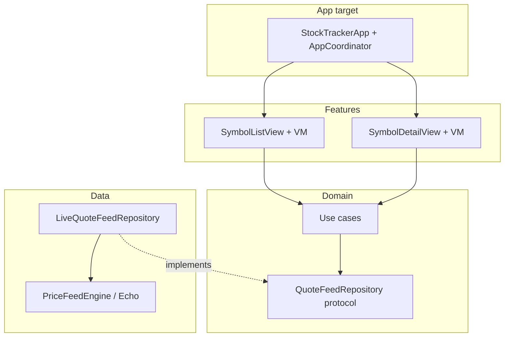
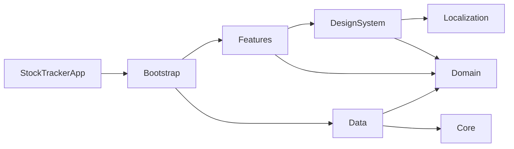

# Stock Tracker iOS

A production-style **iOS stock quote demo**: live-updating list and symbol detail, localization, layout direction control, and a path to swap in real market data—without coupling the UI to WebSockets or JSON.

Built with **Clean Architecture**, **Swift 6** strict concurrency, and **local Swift Package Manager (SPM)** modules. The app tracks **25 symbols**, streams simulated prices over WebSocket ([Postman Echo](https://postman-echo.com) by default), and ships with **English/Arabic** strings, **RTL/LTR** override, per-symbol **USD / AED / INR**, telemetry, and CI.

---

## Big picture

| Layer | What it is in this repo |
|-------|-------------------------|
| **App shell** | Thin iOS target: launch, navigation, config plists, privacy manifest |
| **Features** | SwiftUI screens + `@Observable` view models; talk to **Domain** only |
| **Domain** | Business rules: entities, use cases, repository **protocols** (no UI, no network) |
| **Data** | Repository **implementations**: WebSocket feed, in-memory store, bundled catalog |
| **Core** | Shared infrastructure: WebSocket client, logging, metrics, price formatting |
| **Bootstrap** | **Composition root**: wires concrete types once at startup |
| **DesignSystem / Localization** | Reusable UI theme, components, strings |

**Runtime flow (simplified):**

1. `StockTrackerApp` builds `AppDependencies` via `CompositionRoot` (catalog + `LiveQuoteFeedRepository`).
2. `AppCoordinator` owns `NavigationStack` and pushes `Symbol` detail routes.
3. List/detail view models call **use cases** (`ObserveQuotes`, `StartPriceFeed`, `GetSymbolDetails`, …).
4. Use cases call `QuoteFeedRepository`; **Data** pushes price updates from the WebSocket engine into `QuoteStore` and exposes async streams.
5. UI observes view model state; feed start/stop and sort are domain operations, not view logic.



**Dependency rule (the one rule to remember):**

```text
Features  →  Domain  ←  Data
                ↑
              Core
Bootstrap connects Features + Data + config; Features never import Data.
```

That keeps screens testable with mocks and lets you replace Postman Echo with a licensed feed by changing **Data** + **Bootstrap** only. Deeper diagrams and trade-offs: [docs/ARCHITECTURE.md](docs/ARCHITECTURE.md).

---

## Why this approach?

### Clean Architecture

- **Domain** holds policies and abstractions; it does not know SwiftUI, URLSession, or `symbols.json`.
- **Data** is an adapter: it maps external messages into domain entities and satisfies `QuoteFeedRepository`.
- **Features** orchestrate user intent through use cases instead of calling WebSocket APIs directly.
- Inward dependencies only—violations (e.g. `import Data` in a view model) would lock the UI to one feed and one JSON shape.

### Independent SPM packages

Each major layer is its own package under `Packages/`:

| Benefit | How it shows up here |
|---------|----------------------|
| **Compile boundaries** | Swift enforces imports; the dependency rule is hard to accidentally break |
| **Focused tests** | Domain/Core run with `swift test`; Data/Features on iOS Simulator |
| **Parallel work** | Clear ownership: Data vs Features vs DesignSystem |
| **Reuse** | Domain + Core could back a widget or CLI without dragging in SwiftUI |

The app target stays small; almost all code lives in packages referenced from `project.yml` / Xcode.

### Standard patterns

| Pattern | Where |
|---------|--------|
| **MVVM** | `SymbolListViewModel`, `SymbolDetailViewModel` + SwiftUI views |
| **Coordinator** | `AppCoordinator` + `NavigationPath` / deep links |
| **Composition root** | `CompositionRoot`, `AppDependencies`, `QuoteFeedRepositoryFactory` |
| **Repository + use cases** | `QuoteFeedRepository` + observe/start/stop/sort/details use cases |
| **Actor isolation** | Live repository and store for safe concurrent streams (Swift 6) |

Documented in full: [Standard patterns](docs/ARCHITECTURE.md#standard-patterns-used), [Why SPM packages?](docs/ARCHITECTURE.md#why-independent-swift-packages).

---

## Prerequisites

Before cloning and building, install or verify:

| Requirement | Version / notes |
|-------------|-----------------|
| **macOS + Xcode** | **Xcode 27+** (Swift 6 toolchains, iOS 27 SDK) |
| **iOS deployment** | **iOS 17+** (see `project.yml`) |
| **XcodeGen** | Generates `StockTracker.xcodeproj` from [`project.yml`](project.yml). Install: `brew install xcodegen` |
| **SwiftLint** | CI runs `swiftlint lint --strict`. Install: `brew install swiftlint` |
| **iOS Simulator** | Required for Data/Features tests and UI tests; CI script auto-selects a device (iPhone 17 → 16 → …) |

Optional but useful:

- **GitHub CLI** (`gh`) if you work with PRs and Actions from the terminal
- Network access for WebSocket demo (Postman Echo) when using **Start** on the list screen

No CocoaPods or third-party SDKs are required for the demo feed.

---

## Repository layout

```text
stock-tracker-ios/
├── StockTrackerApp/              # iOS application target (thin shell)
│   ├── StockTrackerApp.swift     # @main, bootstrap, root view
│   ├── Navigation/
│   │   └── AppCoordinator.swift  # NavigationStack, deep links, layout env
│   ├── AppConfig.plist           # WebSocket URL, locale, currency override, tick tuning
│   ├── Info.plist
│   └── PrivacyInfo.xcprivacy     # Apple privacy manifest
├── StockTrackerUITests/          # XCUITest: list, feed control, navigate to symbol
├── Packages/                     # Local SPM modules (see table below)
├── Scripts/
│   └── ci-test.sh                # Lint + unit/UI tests (local & CI)
├── docs/
│   ├── ARCHITECTURE.md           # Layers, packages, concurrency, testing
│   ├── COMPLIANCE.md             # Privacy & logging policy
│   ├── OPERATIONS.md             # Telemetry, metrics, runbooks
│   └── README.md                 # Doc index
├── .github/workflows/ios.yml     # CI: runs ci-test.sh, uploads xcresult
├── project.yml                   # XcodeGen: app + package references
├── .swiftlint.yml
└── README.md                     # You are here
```

### `Packages/` module map

| Package | Clean Architecture role | Responsibility |
|---------|-------------------------|----------------|
| **Domain** | Entities + use cases | `Quote`, `Symbol`, `QuoteFeedRepository`, observe/start/stop/sort/details, `QuoteFeedSession` |
| **Data** | Interface adapters | `LiveQuoteFeedRepository`, `QuoteStore`, `BundledSymbolCatalog`, `EchoPriceFeedEngine`, `PriceFeedEngine` |
| **Core** | Drivers / shared infra | `WebSocketClient`, interceptors, `AppTelemetry`, `PriceFormatting`, configuration helpers |
| **Features** | Interface adapters (UI) | `SymbolListView`, `SymbolDetailView`, view models |
| **DesignSystem** | UI framework | Theme, `StockRowCard`, RTL row layout, icons, detail cards |
| **Localization** | Resources | `Localizable.xcstrings`, typed `L10n` |
| **Bootstrap** | Composition root | `CompositionRoot`, `AppDependencies`, repository factory |
| **TestSupport** | Tests only | Actor mocks (`QuoteFeedRepositoryMock`, WebSocket doubles)—not linked in release app |

Per-package notes: [Packages/README.md](Packages/README.md).

### Key files inside packages

```text
Packages/
├── Domain/Sources/Domain/
│   ├── QuoteFeedRepository.swift
│   ├── QuoteFeedSession.swift
│   └── UseCases/                 # ObserveQuotes, Start/StopPriceFeed, Sort, GetSymbolDetails, …
├── Data/Sources/Data/
│   ├── LiveQuoteFeedRepository.swift
│   ├── EchoPriceFeedEngine.swift
│   ├── PriceFeedEngine.swift     # Swap point for production feed
│   └── Resources/symbols.json    # 25 symbols + metadata + currencyCode
├── Bootstrap/Sources/Bootstrap/
│   ├── CompositionRoot.swift
│   └── QuoteFeedRepositoryFactory.swift
├── Features/Sources/Features/
│   ├── SymbolList/
│   └── SymbolDetail/
└── DesignSystem/Sources/DesignSystem/
    ├── Layout/StockListRowLayout.swift
    └── Components/               # Row cards, hero, connection status, …
```



`DesignSystem` imports **Domain** for display types (documented compromise; presentation DTOs would decouple further in a larger app).

---

## Features (product)

| Area | Behavior |
|------|----------|
| **List** | Live quotes, sort by price or session change, connection status, start/stop feed |
| **Detail** | Hero price, market metadata grid, about text; cached detail VM survives layout changes |
| **Theming** | Semantic light/dark colors, cards, gradients |
| **Localization** | EN + AR via `Localizable.xcstrings` |
| **Layout** | Toolbar: automatic / LTR / RTL; rows mirror with navigation bar |
| **Currency** | Per-symbol codes in catalog; optional app-wide override in `AppConfig.plist` |
| **Deep links** | `stocktracker://symbol/{TICKER}` |
| **Observability** | OSLog telemetry + WebSocket metrics |

---

## Get started

### 1. Generate the Xcode project

```bash
xcodegen generate
open StockTracker.xcodeproj
```

### 2. Run

1. Scheme: **StockTracker**
2. Destination: any **iOS Simulator** (iOS 17+)
3. Build and run
4. On the list screen, tap **Start** to open the WebSocket configured in `AppConfig.plist`

### 3. Configuration (`StockTrackerApp/AppConfig.plist`)

| Key | Description | Example |
|-----|-------------|---------|
| `WebSocketURL` | WebSocket endpoint | `wss://ws.postman-echo.com/raw` |
| `TickIntervalNanoseconds` | Delay between echo ticks | `800000000` (~0.8s) |
| `SymbolsPerTick` | Symbols updated per tick | `2` |
| `LocaleIdentifier` | App locale | `en`, `ar` |
| `CurrencyCode` | Optional override for all formatted prices | `USD`, `AED`, `INR` (omit for per-symbol catalog) |

Catalog source: [`Packages/Data/Sources/Data/Resources/symbols.json`](Packages/Data/Sources/Data/Resources/symbols.json).

---

## Tests & quality

### Full pipeline (matches CI)

```bash
chmod +x Scripts/ci-test.sh
./Scripts/ci-test.sh
```

Runs **SwiftLint (strict)**, **Domain** tests with coverage floor (default **45%**, env `MIN_DOMAIN_COV`), **Core** tests, **Data** + **Features** on Simulator, then **StockTracker** unit/UI tests. Output: `TestResults.xcresult`.

Simulator selection (override if needed):

```bash
SIM_DEST='platform=iOS Simulator,name=iPhone 17 Pro' ./Scripts/ci-test.sh
SIM_DEVICE_NAME='iPhone 17 Pro' ./Scripts/ci-test.sh
```

### Individual commands

```bash
swiftlint lint --strict

cd Packages/Domain && swift test --enable-code-coverage
cd Packages/Core && swift test

cd Packages/Data && xcodebuild test -scheme Data -destination 'platform=iOS Simulator,name=iPhone 17 Pro' CODE_SIGNING_ALLOWED=NO
cd Packages/Features && xcodebuild test -scheme Features -destination 'platform=iOS Simulator,name=iPhone 17 Pro' CODE_SIGNING_ALLOWED=NO

xcodegen generate
xcodebuild -scheme StockTracker -destination 'platform=iOS Simulator,name=iPhone 17 Pro' CODE_SIGNING_ALLOWED=NO test
```

**Note:** `Features` and `DesignSystem` use UIKit/iOS APIs—use Simulator `xcodebuild test`, not macOS `swift test`.

### CI

[`.github/workflows/ios.yml`](.github/workflows/ios.yml) runs `Scripts/ci-test.sh` and uploads `TestResults.xcresult`.

---

## Swapping in production market data

The demo uses [`EchoPriceFeedEngine`](Packages/Data/Sources/Data/EchoPriceFeedEngine.swift).

1. Implement [`PriceFeedEngine`](Packages/Data/Sources/Data/PriceFeedEngine.swift) for your vendor protocol.
2. Register it in [`QuoteFeedRepositoryFactory`](Packages/Bootstrap/Sources/Bootstrap/QuoteFeedRepositoryFactory.swift).
3. Leave **Domain** and **Features** unchanged; map vendor payloads in **Data** if they differ from [`PriceUpdateMessage`](Packages/Domain/Sources/Domain/PriceUpdateMessage.swift).

---

## Documentation index

| Document | Contents |
|----------|----------|
| [docs/ARCHITECTURE.md](docs/ARCHITECTURE.md) | Clean Architecture rings, dependency rule, package catalog, concurrency, testing |
| [docs/COMPLIANCE.md](docs/COMPLIANCE.md) | Privacy manifest, storage, logging |
| [docs/OPERATIONS.md](docs/OPERATIONS.md) | Telemetry, metrics, health checks |
| [Packages/README.md](Packages/README.md) | SPM dependency graph and test commands |


Video 


https://github.com/user-attachments/assets/d86fcf44-210e-4b95-b898-2db0e1b88230


---

## License

Add a license file if you open-source or distribute this project.
