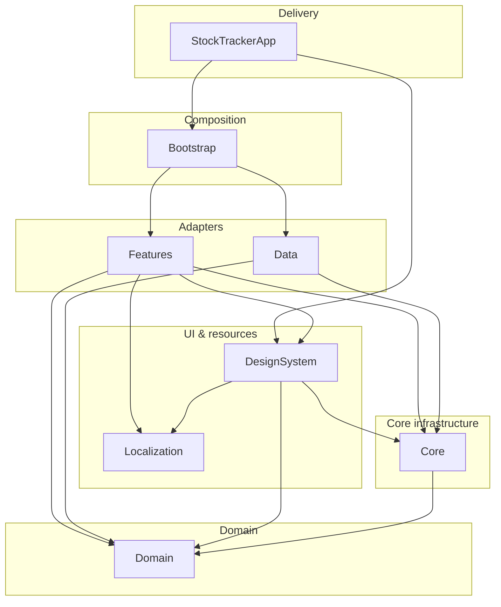

# Architecture

This document explains **why** the Stock Tracker app is structured the way it is: Clean Architecture on iOS, independent Swift packages, and the standards we follow in code and CI.

## Clean Architecture (what and why)

[Clean Architecture](https://blog.cleancoder.com/uncle-bob/2012/08/13/the-clean-architecture.html) separates policy from details so that:

- **Business rules** do not depend on UI, networking, or the database.
- **Details** (SwiftUI, WebSocket, JSON files) can be swapped without rewriting use cases.
- **Tests** can run fast against the center of the app without simulators or network.

### Concentric layers (conceptual)

```text
        ┌─────────────────────────────────────────────┐
        │  Frameworks & drivers (UI, WebSocket, …)   │
        │  ┌─────────────────────────────────────┐   │
        │  │ Interface adapters (VMs, presenters)  │   │
        │  │  ┌───────────────────────────────┐   │   │
        │  │  │ Use cases (application rules)  │   │   │
        │  │  │  ┌─────────────────────────┐  │   │   │
        │  │  │  │ Entities (enterprise)    │  │   │   │
        │  │  │  └─────────────────────────┘  │   │   │
        │  │  └───────────────────────────────┘   │   │
        │  └─────────────────────────────────────┘   │
        └─────────────────────────────────────────────┘

Dependencies point **inward** only.
```

| Clean Architecture ring | Responsibility | This repo |
|-------------------------|----------------|-----------|
| **Entities** | Core business objects and invariants | `Domain` — `Quote`, `StockSymbol`, `Symbol`, `CurrencyCode` |
| **Use cases** | Application-specific rules; orchestrate entities | `Domain` — `ObserveQuotesUseCase`, `SortQuotesUseCase`, `GetSymbolDetailsUseCase`, `QuoteFeedSession` |
| **Interface adapters** | Convert data between use cases and external world | `Features` (view models + SwiftUI), `Data` (repository impl), mappers in catalog |
| **Frameworks & drivers** | UI toolkit, HTTP/WebSocket, filesystem | `DesignSystem`, `Core`, `Data` engines, `Localization` resources |
| **Composition** | Wire concrete implementations | `Bootstrap` — `CompositionRoot`, factories |
| **Delivery mechanism** | App entry, navigation shell | `StockTrackerApp` — `@main`, `AppCoordinator` |

### Dependency rule (enforced)

```text
Features  ──▶  Domain  ◀──  Data
                 ▲
Core ────────────┘
```

- **Features** import **Domain** (protocols + use cases), not **Data**.
- **Data** implements `QuoteFeedRepository` defined in **Domain**.
- **Bootstrap** is the only module that knows both **Features** and **Data** and binds them at launch.
- **StockTrackerApp** stays thin: coordinator, root layout, plists—no repository construction in views.

Violating the rule (e.g. `import Data` inside a view model) couples screens to Postman Echo, JSON shape, and actors—making tests and feed swaps expensive.

### Pragmatic compromises (documented)

| Choice | Ideal pure CA | What we did | Reason |
|--------|----------------|-------------|--------|
| DesignSystem → Domain | UI kit knows nothing of entities | Components take `Quote`, `StockSymbol` | Fewer DTO duplicates in a demo; trade-off is acceptable with clear module boundary |
| Core → Domain | Infrastructure independent of entities | `AppTelemetry` references `ConnectionStatus` | Shared vocabulary for logs/metrics |
| Echo WebSocket feed | Production market API | Postman Echo + `PriceFeedEngine` protocol | Demo/interview scope; swap point is explicit |

When hardening for production, introduce **presentation models** in Features and keep DesignSystem free of Domain if white-label or multi-app reuse is required.

---

## Why independent Swift packages?

The app is split into **local path-based SPM modules** under [`Packages/`](../Packages/), not a single app target with folder groups.

### Benefits

| Benefit | How it shows up here |
|---------|----------------------|
| **Compile-time boundaries** | Wrong `import` fails at build time, not in code review only |
| **Faster iteration** | Change `Domain` → run `Packages/Domain` tests only; no full app rebuild required for logic |
| **Parallel ownership** | Teams can own Data vs Features with clear contracts (`QuoteFeedRepository`) |
| **Testability** | Domain/Core tests on macOS; UI-adjacent packages on Simulator via `ci-test.sh` |
| **Reuse** | `DesignSystem`, `Localization`, `Core` could ship in another app without copying sources |
| **CI granularity** | Domain coverage gate, per-package Simulator tests, lint on whole tree |
| **Onboarding** | New engineers learn one package at a time; [`Packages/README.md`](../Packages/README.md) maps roles |

### Why not one Xcode target?

A monolithic target tends toward:

- Hidden dependencies (views calling `URLSession` directly)
- Slow test cycles (always build the app)
- Merge conflicts in one giant project file

We use **XcodeGen** ([`project.yml`](../project.yml)) so the app target **links** packages by path; packages remain the source of truth for their `Package.swift`.

### Package catalog

| Package | Layer (primary) | Why separate |
|---------|-----------------|--------------|
| **Domain** | Entities + use cases | Zero UI/IO; fastest tests; defines repository **ports** |
| **Core** | Infrastructure shared across data & app | WebSocket, config, formatting, telemetry—no SwiftUI |
| **Data** | Adapter + drivers | Echo engine, `QuoteStore`, bundled `symbols.json`—replaceable |
| **Features** | Interface adapters | MVVM + SwiftUI; depends on ports, not echo impl |
| **DesignSystem** | UI framework | Theme, components, RTL; reusable visual language |
| **Localization** | Resource module | String catalog + `L10n`; single place for EN/AR |
| **Bootstrap** | Composition root | All `make()` wiring; keeps `@main` trivial |
| **TestSupport** | Test doubles | Mocks not shipped in app target |
| **StockTrackerApp** | Delivery | Coordinator, plists, privacy manifest |

---

## Standard patterns used

### MVVM (presentation)

- **View:** SwiftUI in `Features` (`SymbolListView`, `SymbolDetailView`).
- **ViewModel:** `@MainActor` `@Observable` types; call **use cases**, never WebSocket APIs.
- **Model:** Domain entities (`Quote`, etc.) flow from use cases/streams.

View models **subscribe** to `AsyncStream` from `ObserveQuotesUseCase`; they do **not** start/stop the feed on `onDisappear`—`QuoteFeedSession` owns lifecycle (avoids list/detail tearing down shared feed).

### Coordinator (navigation)

- **`AppCoordinator`** holds `NavigationPath` and push/deep-link actions.
- **Domain** exposes `AppCoordinating` / `DeepLinkParser` for testable URL rules (`stocktracker://symbol/NVDA`).
- Views take closures or coordinator bindings; they do not embed routing policy.

This matches common iOS **flow coordination** without massive routers in SwiftUI.

### Composition Root (dependency injection)

- **`CompositionRoot.make()`** in Bootstrap constructs one `LiveQuoteFeedRepository`, shared use cases, and `AppDependencies`.
- Failures return `Result` → **`BootstrapFailureView`** (no `fatalError` on missing catalog).
- **`AppDependencies`** exposes `@MainActor` factory methods for view models (cached list VM for single subscription policy).

Constructor injection throughout; no service locator in feature code.

### Repository + use case (ports and adapters)

- **Port:** `QuoteFeedRepository` (Domain).
- **Adapter:** `LiveQuoteFeedRepository` actor (Data).
- **Use cases:** thin facades (`StartPriceFeedUseCase`, `ObserveQuotesUseCase`, …) so view models depend on verbs, not the repository surface area.

---

## Goals (technical)

- **Testable** domain and use cases independent of UI and transport
- **Single** quote stream shared by list and detail
- **Swift 6** concurrency with actor-isolated market data
- **Replaceable** price engine via `PriceFeedEngine` without rewriting Features

## Module dependency diagram



## Real-time data flow

```text
EchoPriceFeedEngine ──PriceUpdateMessage──▶ QuoteStore (actor)
        │                                      │
        │ ConnectionStatus                     │ [Quote]
        ▼                                      ▼
LiveQuoteFeedRepository (actor) ◀── AsyncStream ── ObserveQuotesUseCase
        │
        └── QuoteFeedSession (start/stop) ◀── SymbolListViewModel
```

- **Baseline change:** session change vs seed price when the repository is created.
- **Tick change:** delta vs previous tick (detail / market data card).
- **Multicast:** multiple `quotesStream()` subscribers receive the same snapshots.

## Concurrency model

| Component | Isolation |
|-----------|-----------|
| `LiveQuoteFeedRepository` | `actor` |
| `QuoteStore` | `actor` |
| `EchoPriceFeedEngine` | `actor` |
| `QuoteFeedRepositoryMock` | `actor` |
| `AppDependencies` | `Sendable`; VM factories `@MainActor` |
| `SymbolListViewModel` / `SymbolDetailViewModel` | `@MainActor` `@Observable` |

Package targets enable **Swift 6** and **`StrictConcurrency`**. Production code avoids `@unchecked Sendable`.

Repository reads from UI are **async** (`quote(for:)`, `GetSymbolDetailsUseCase.execute`).

## Localization and layout

- Strings: `Packages/Localization` only; features use `L10n`.
- Locale from `AppConfig.plist` → `LayoutPreferences` on the root view.
- RTL/LTR user override persisted in `@AppStorage("userLayoutDirectionChoice")`.
- **`StockListRowLayout`** explicitly mirrors icon / title / price when SwiftUI scroll views do not inherit bar direction.

## Observability

| API | Role |
|-----|------|
| `AppTelemetry` / `OSLogAppTelemetry` | Product events (launch, bootstrap, feed, connection) |
| `OSLogLogger` | Network interceptor logs (host + byte counts) |
| `WebSocketMetricsRecorder` | Counters for connect/send/receive/failures |

Wiring: `CompositionRoot` → `AppDependencies` → list view model. See [OPERATIONS.md](OPERATIONS.md).

## Extension: production feed

1. Add a type conforming to [`PriceFeedEngine`](../Packages/Data/Sources/Data/PriceFeedEngine.swift).
2. Inject it when building `LiveQuoteFeedRepository` inside [`QuoteFeedRepositoryFactory`](../Packages/Bootstrap/Sources/Bootstrap/QuoteFeedRepositoryFactory.swift).
3. Keep message decoding aligned with [`PriceUpdateMessage`](../Packages/Domain/Sources/Domain/PriceUpdateMessage.swift) or introduce a mapper in Data.

Domain and Features remain unchanged if the repository honors the same port contract.

## Testing strategy (by layer)

| Layer | What we prove | Tooling |
|-------|---------------|---------|
| Domain | Sort rules, message decoding, session delegates to use cases | Swift Testing |
| Core | WebSocket wrapper, interceptors, formatting | XCTest |
| Data | Catalog load, repository streams, malformed echo | XCTest (Simulator) |
| Features | View model + use case integration | Swift Testing (Simulator) |
| App | Launch, list, navigation, feed control | UI tests |

CI: [`Scripts/ci-test.sh`](../Scripts/ci-test.sh).

## Quality gates

- SwiftLint **`--strict`** ([`.swiftlint.yml`](../.swiftlint.yml))
- Domain line coverage ≥ `MIN_DOMAIN_COV` (default 45%)
- No `@unchecked Sendable` in production source packages
- iOS Simulator auto-selection for package/app tests (see [OPERATIONS.md](OPERATIONS.md))

## Related documents

- [Packages/README.md](../Packages/README.md) — per-package file layout and test commands
- [COMPLIANCE.md](COMPLIANCE.md) — privacy and logging boundaries
- [OPERATIONS.md](OPERATIONS.md) — telemetry and CI troubleshooting
